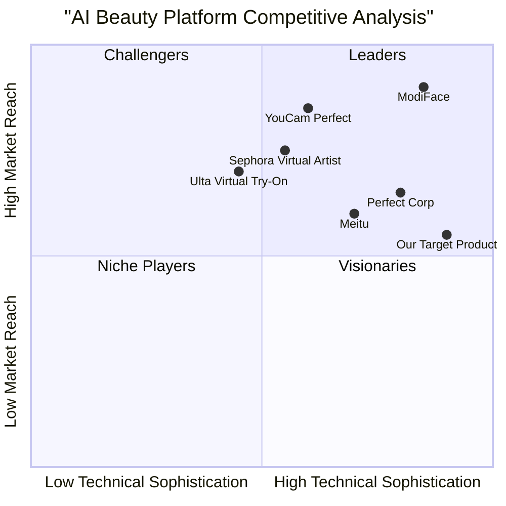

# AI Face Analysis & Cosmetics Recommendation Platform - Product Requirements Document

## 1. Project Information

**Language**: English  
**Programming Language**: Python (Backend), React/TypeScript (Frontend), TensorFlow/PyTorch (AI Models)  
**Project Name**: face_analysis_platform  
**Document Version**: 1.0  
**Date**: September 6, 2025  

### Original Requirements
Transform the existing Brain Wave platform into an AI-powered face analysis and cosmetics recommendation system that:
- Detects and analyzes facial features using advanced computer vision
- Provides personalized cosmetics recommendations based on facial analysis
- Offers health suggestions derived from facial indicators
- Supports photo and video uploads through an AI chatbot interface
- Implements CNN-based feature extraction with temporal analysis capabilities

## 2. Product Definition

### 2.1 Product Goals

1. **Personalized Beauty Intelligence**: Deliver AI-driven cosmetics recommendations tailored to individual facial features, skin tone, and beauty preferences with 90%+ accuracy
2. **Health-Conscious Beauty**: Provide facial health insights and wellness suggestions based on skin analysis, promoting both beauty and health awareness
3. **Seamless User Experience**: Create an intuitive platform combining advanced AI technology with user-friendly interfaces for photo/video analysis and real-time recommendations

### 2.2 User Stories

**As a beauty enthusiast**, I want to upload my photo and receive personalized makeup recommendations so that I can discover products that enhance my natural features.

**As a skincare-conscious user**, I want the AI to analyze my facial skin condition and provide health suggestions so that I can maintain healthy skin while using cosmetics.

**As a content creator**, I want to upload videos to get dynamic beauty analysis and recommendations so that I can create better beauty content with optimal makeup choices.

**As a busy professional**, I want quick AI-powered beauty consultations through a chatbot so that I can get expert advice without scheduling appointments.

**As a cosmetics retailer**, I want to integrate this platform into my e-commerce site so that I can provide personalized product recommendations to increase sales conversion.

### 2.3 Competitive Analysis

#### Direct Competitors

1. **ModiFace (L'Oréal)**
   - **Pros**: Industry leader, AR try-on technology, brand partnerships
   - **Cons**: Limited health analysis, expensive licensing, brand-restricted recommendations
   - **Market Position**: Premium B2B solution

2. **YouCam Perfect**
   - **Pros**: Popular mobile app, real-time filters, social sharing
   - **Cons**: Focus on entertainment over analysis, limited health insights
   - **Market Position**: Consumer entertainment app

3. **Sephora Virtual Artist**
   - **Pros**: Integrated with e-commerce, brand credibility, AR features
   - **Cons**: Limited to Sephora products, basic analysis capabilities
   - **Market Position**: Retail-focused solution

4. **Perfect Corp Beauty AI**
   - **Pros**: B2B white-label solutions, comprehensive SDK
   - **Cons**: High implementation costs, limited customization
   - **Market Position**: Enterprise technology provider

5. **Meitu**
   - **Pros**: Strong in Asian markets, advanced face editing
   - **Cons**: Privacy concerns, limited Western market presence
   - **Market Position**: Regional consumer app

#### Indirect Competitors

6. **Ulta Beauty Virtual Try-On**
   - **Pros**: Large product catalog, retail integration
   - **Cons**: Basic AI capabilities, limited analysis depth

7. **MAC Virtual Try-On**
   - **Pros**: Professional brand reputation, quality products
   - **Cons**: Single-brand limitation, basic recommendation engine

### 2.4 Competitive Quadrant Chart



## 3. Technical Specifications

### 3.1 Requirements Analysis

The AI Face Analysis & Cosmetics Recommendation Platform requires a sophisticated computer vision pipeline integrated with machine learning models for beauty analysis and recommendation systems. The platform must handle real-time image/video processing, maintain user privacy, and provide accurate, personalized recommendations.

**Core Technical Requirements:**
- Advanced facial detection and landmark extraction
- CNN-based feature analysis with temporal processing
- Real-time image/video processing capabilities
- Scalable cloud infrastructure for AI model deployment
- Secure data handling and privacy protection
- Cross-platform compatibility (web, mobile)

### 3.2 Requirements Pool

#### P0 Requirements (Must-Have)

**Face Detection & Analysis**
- **REQ-001**: The system MUST detect faces in uploaded images with 99%+ accuracy
- **REQ-002**: The system MUST extract 68+ facial landmarks for precise feature mapping
- **REQ-003**: The system MUST normalize lighting conditions and remove noise from images
- **REQ-004**: The system MUST scale images to optimal resolution for analysis
- **REQ-005**: The system MUST support common image formats (JPEG, PNG, WebP)

**AI Processing Pipeline**
- **REQ-006**: The system MUST use CNN architecture for spatial feature extraction
- **REQ-007**: The system MUST process facial regions of interest (eyes, lips, skin, eyebrows)
- **REQ-008**: The system MUST analyze skin tone, texture, and condition
- **REQ-009**: The system MUST identify facial geometry and proportions
- **REQ-010**: The system MUST complete analysis within 5 seconds per image

**Cosmetics Recommendation Engine**
- **REQ-011**: The system MUST provide personalized makeup recommendations based on facial analysis
- **REQ-012**: The system MUST recommend products for foundation, concealer, lipstick, and eyeshadow
- **REQ-013**: The system MUST consider skin tone matching for product suggestions
- **REQ-014**: The system MUST maintain a database of 10,000+ cosmetic products
- **REQ-015**: The system MUST provide confidence scores for each recommendation

**User Interface**
- **REQ-016**: The system MUST provide an AI chatbot interface for user interactions
- **REQ-017**: The system MUST support photo upload via drag-and-drop and file selection
- **REQ-018**: The system MUST display analysis results with visual overlays
- **REQ-019**: The system MUST be responsive across desktop and mobile devices
- **REQ-020**: The system MUST provide real-time feedback during upload and processing

#### P1 Requirements (Should-Have)

**Video Analysis**
- **REQ-021**: The system SHOULD support video upload and analysis
- **REQ-022**: The system SHOULD extract temporal features from video sequences
- **REQ-023**: The system SHOULD analyze facial expressions and movements
- **REQ-024**: The system SHOULD support video formats (MP4, AVI, MOV)
- **REQ-025**: The system SHOULD process videos up to 30 seconds in length

**Health Analysis**
- **REQ-026**: The system SHOULD identify potential skin health indicators
- **REQ-027**: The system SHOULD provide wellness suggestions based on facial analysis
- **REQ-028**: The system SHOULD detect signs of fatigue, stress, or dehydration
- **REQ-029**: The system SHOULD recommend skincare routines based on skin condition
- **REQ-030**: The system SHOULD provide disclaimers for health-related suggestions

**Advanced Features**
- **REQ-031**: The system SHOULD extract Facial Action Units (FAUs) for expression analysis
- **REQ-032**: The system SHOULD provide virtual try-on capabilities
- **REQ-033**: The system SHOULD support batch processing of multiple images
- **REQ-034**: The system SHOULD integrate with e-commerce platforms via API
- **REQ-035**: The system SHOULD maintain user history and preferences

#### P2 Requirements (Nice-to-Have)

**Enhanced Capabilities**
- **REQ-036**: The system MAY support real-time webcam analysis
- **REQ-037**: The system MAY provide augmented reality (AR) try-on features
- **REQ-038**: The system MAY offer social sharing capabilities
- **REQ-039**: The system MAY support multiple languages and cultural beauty standards
- **REQ-040**: The system MAY integrate with social media platforms

### 3.3 UI Design Draft

#### Main Interface Layout
```
┌─────────────────────────────────────────────────────┐
│ AI Beauty Analyzer                    [Profile] [?] │
├─────────────────────────────────────────────────────┤
│                                                     │
│  ┌─────────────────┐    ┌─────────────────────────┐ │
│  │                 │    │ AI Chat Assistant       │ │
│  │   Upload Area   │    │ ┌─────────────────────┐ │ │
│  │                 │    │ │ Hello! Upload your  │ │ │
│  │ [📷 Photo]      │    │ │ photo and I'll      │ │ │
│  │ [🎥 Video]      │    │ │ analyze your beauty │ │ │
│  │                 │    │ │ features!           │ │ │
│  └─────────────────┘    │ └─────────────────────┘ │ │
│                         │                         │ │
│  ┌─────────────────────────────────────────────┐   │ │
│  │ Analysis Results                            │   │ │
│  │ • Skin Tone: Warm Medium                   │   │ │
│  │ • Face Shape: Oval                         │   │ │
│  │ • Recommended: Foundation #4, Lipstick #12 │   │ │
│  └─────────────────────────────────────────────┘   │ │
│                                                     │
└─────────────────────────────────────────────────────┘
```

#### Analysis Results Display
```
┌─────────────────────────────────────────────────────┐
│ Your Beauty Analysis Results                        │
├─────────────────────────────────────────────────────┤
│                                                     │
│ ┌─────────────┐  ┌─────────────────────────────────┐ │
│ │   Original  │  │ Facial Features Detected        │ │
│ │    Photo    │  │ • Eyes: Almond shape           │ │
│ │             │  │ • Lips: Full, natural color    │ │
│ │             │  │ • Skin: Smooth texture         │ │
│ │             │  │ • Face Shape: Heart            │ │
│ └─────────────┘  └─────────────────────────────────┘ │
│                                                     │
│ ┌─────────────────────────────────────────────────┐ │
│ │ Personalized Recommendations                    │ │
│ │                                                 │ │
│ │ Foundation: [Product Image] Brand X Shade 4    │ │
│ │ Confidence: 94%                                 │ │
│ │                                                 │ │
│ │ Lipstick: [Product Image] Brand Y Rose Pink    │ │
│ │ Confidence: 89%                                 │ │
│ │                                                 │ │
│ │ [View All Recommendations] [Try Virtual Makeup] │ │
│ └─────────────────────────────────────────────────┘ │
│                                                     │
└─────────────────────────────────────────────────────┘
```

### 3.4 Open Questions

1. **Privacy & Data Handling**: How long should facial data be retained? What privacy controls should users have over their biometric data?

2. **Model Training Data**: What datasets will be used for training? How will we ensure diversity and avoid bias in beauty standards?

3. **Integration Partnerships**: Which cosmetics brands should we prioritize for product database integration?

4. **Regulatory Compliance**: What regulations apply to facial recognition and health-related suggestions in different markets?

5. **Monetization Strategy**: Should the platform use subscription, per-analysis, or commission-based pricing models?

6. **Accuracy Validation**: How will we validate the accuracy of health suggestions and ensure they don't constitute medical advice?

7. **Cultural Adaptation**: How will beauty standards be adapted for different cultural contexts and markets?

8. **Performance Optimization**: What are the acceptable response times for different types of analysis (photo vs. video)?

## 4. Market Research & Analysis

### 4.1 Market Size & Opportunity

The global beauty tech market is experiencing explosive growth, valued at $8.2 billion in 2023 and projected to reach $17.4 billion by 2028, representing a CAGR of 16.2%. The AI-powered beauty segment specifically is growing at 22.3% annually, driven by increasing consumer demand for personalized beauty solutions.

**Key Market Drivers:**
- Rising adoption of AI and AR technologies in beauty
- Growing demand for personalized cosmetics recommendations
- Increased online beauty shopping post-pandemic
- Social media influence on beauty trends and product discovery

### 4.2 Target User Personas

#### Primary Persona: "Beauty Explorer Sarah"
- **Demographics**: Female, 25-35, urban professional
- **Behavior**: Active on social media, shops online frequently, values personalization
- **Pain Points**: Difficulty finding right shade matches, overwhelmed by product choices
- **Goals**: Discover products that enhance natural beauty, save time on beauty decisions

#### Secondary Persona: "Health-Conscious Maya"
- **Demographics**: Female, 30-45, health and wellness focused
- **Behavior**: Researches ingredients, prefers clean beauty, values skin health
- **Pain Points**: Concerns about cosmetic ingredients affecting skin health
- **Goals**: Find products that are both beautiful and beneficial for skin health

#### Tertiary Persona: "Tech-Savvy Gen Z Emma"
- **Demographics**: Female, 18-25, digital native
- **Behavior**: Early adopter of beauty tech, creates content, values authenticity
- **Pain Points**: Wants cutting-edge features, expects seamless mobile experience
- **Goals**: Access to latest beauty tech, shareable results, trend discovery

### 4.3 Implementation Roadmap

#### Phase 1: Core Platform (Months 1-4)
- Basic face detection and landmark extraction
- Simple cosmetics recommendation engine
- Photo upload and analysis interface
- AI chatbot integration

#### Phase 2: Advanced Analysis (Months 5-8)
- CNN-based feature extraction implementation
- Health suggestion algorithms
- Video upload and temporal analysis
- Enhanced recommendation accuracy

#### Phase 3: Market Expansion (Months 9-12)
- Virtual try-on capabilities
- E-commerce platform integrations
- Mobile app development
- Partnership with cosmetics brands

## 5. Success Metrics

### 5.1 Key Performance Indicators

**User Engagement**
- Daily Active Users (DAU): Target 10,000 by month 6
- Session Duration: Average 8+ minutes per session
- Analysis Completion Rate: 85%+ of uploads result in full analysis

**Technical Performance**
- Analysis Accuracy: 90%+ user satisfaction with recommendations
- Processing Speed: <5 seconds for photo analysis, <30 seconds for video
- System Uptime: 99.5% availability

**Business Metrics**
- User Retention: 60% monthly retention rate
- Conversion Rate: 15% of users make product purchases through recommendations
- Revenue per User: $25 average monthly value

### 5.2 Risk Assessment

**Technical Risks**
- AI model accuracy may vary across different ethnicities and skin tones
- Processing speed may be slower than expected for complex analyses
- Privacy regulations may limit data collection and processing

**Market Risks**
- Established competitors may launch similar features
- Consumer adoption of AI beauty tech may be slower than projected
- Economic downturns may reduce spending on beauty technology

**Mitigation Strategies**
- Implement diverse training datasets and bias testing
- Optimize models for performance and deploy edge computing solutions
- Develop strong privacy-first architecture and transparent data policies

---

*This PRD serves as the foundation for developing an innovative AI-powered face analysis and cosmetics recommendation platform that combines cutting-edge computer vision technology with personalized beauty insights.*