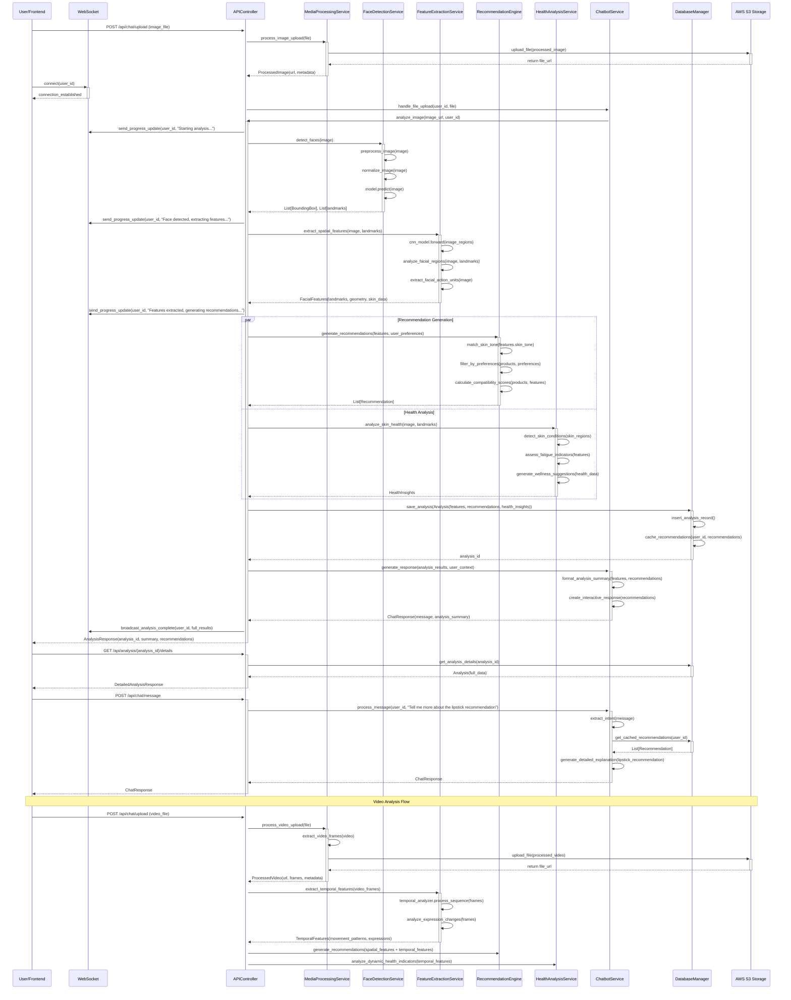

# AI Face Analysis Platform - System Design Document

## Implementation Approach

We will build a scalable, microservices-based AI face analysis platform using modern web technologies and cloud infrastructure. The system leverages advanced computer vision models (CNNs) for facial feature extraction, a recommendation engine for cosmetics suggestions, and health analysis capabilities.

**Key Technology Decisions:**
- **Frontend**: React 18 with TypeScript, Tailwind CSS for responsive design
- **Backend**: FastAPI (Python) for high-performance API services
- **AI/ML**: PyTorch for CNN models, OpenCV for image processing, MediaPipe for facial landmarks
- **Database**: PostgreSQL for relational data, Redis for caching, AWS S3 for media storage
- **Infrastructure**: Docker containers, AWS ECS for orchestration, CloudFront CDN
- **Real-time**: WebSocket connections for live analysis feedback

**Architecture Principles:**
- Microservices for scalability and maintainability
- Event-driven architecture for asynchronous processing
- API-first design for frontend-backend separation
- Privacy-by-design with encrypted data handling
- Cloud-native deployment for global availability

## Data Structures and Interfaces

```mermaid
classDiagram
    class User {
        +user_id: UUID
        +email: string
        +username: string
        +created_at: datetime
        +preferences: UserPreferences
        +privacy_settings: PrivacySettings
        +__init__(email: str, username: str)
        +update_preferences(preferences: dict) bool
        +get_analysis_history() List[Analysis]
    }

    class UserPreferences {
        +skin_tone_preference: string
        +beauty_style: string
        +brand_preferences: List[string]
        +budget_range: tuple
        +allergies: List[string]
        +__init__(user_id: UUID)
        +update_preferences(data: dict) bool
    }

    class Analysis {
        +analysis_id: UUID
        +user_id: UUID
        +image_url: string
        +video_url: string
        +analysis_type: AnalysisType
        +facial_features: FacialFeatures
        +recommendations: List[Recommendation]
        +health_insights: HealthInsights
        +confidence_score: float
        +created_at: datetime
        +__init__(user_id: UUID, media_url: str, analysis_type: AnalysisType)
        +process_analysis() bool
        +get_recommendations() List[Recommendation]
    }

    class FacialFeatures {
        +landmarks: List[Point2D]
        +face_shape: FaceShape
        +skin_tone: SkinTone
        +eye_shape: EyeShape
        +lip_shape: LipShape
        +facial_geometry: FacialGeometry
        +skin_condition: SkinCondition
        +__init__(landmarks: List[Point2D])
        +extract_features() dict
        +calculate_proportions() FacialGeometry
    }

    class FaceDetectionService {
        +model: CNNModel
        +landmark_detector: MediaPipeFace
        +__init__(model_path: str)
        +detect_faces(image: np.ndarray) List[BoundingBox]
        +extract_landmarks(image: np.ndarray, face_box: BoundingBox) List[Point2D]
        +normalize_image(image: np.ndarray) np.ndarray
        +preprocess_image(image: np.ndarray) np.ndarray
    }

    class FeatureExtractionService {
        +cnn_model: ResNetModel
        +temporal_analyzer: TemporalCNN
        +__init__(model_config: dict)
        +extract_spatial_features(image: np.ndarray, landmarks: List[Point2D]) np.ndarray
        +extract_temporal_features(video_frames: List[np.ndarray]) np.ndarray
        +analyze_facial_regions(image: np.ndarray, landmarks: List[Point2D]) dict
        +extract_facial_action_units(image: np.ndarray) List[FAU]
    }

    class RecommendationEngine {
        +product_database: ProductDatabase
        +ml_model: RecommendationModel
        +__init__(db_connection: str, model_path: str)
        +generate_recommendations(features: FacialFeatures, preferences: UserPreferences) List[Recommendation]
        +match_skin_tone(skin_tone: SkinTone) List[Product]
        +calculate_compatibility_score(product: Product, features: FacialFeatures) float
        +filter_by_preferences(products: List[Product], preferences: UserPreferences) List[Product]
    }

    class HealthAnalysisService {
        +health_model: HealthCNN
        +__init__(model_path: str)
        +analyze_skin_health(image: np.ndarray, landmarks: List[Point2D]) HealthInsights
        +detect_skin_conditions(skin_regions: List[np.ndarray]) List[SkinCondition]
        +generate_wellness_suggestions(health_data: HealthInsights) List[WellnessSuggestion]
        +assess_fatigue_indicators(facial_features: FacialFeatures) FatigueLevel
    }

    class ChatbotService {
        +nlp_model: NLPModel
        +conversation_manager: ConversationManager
        +__init__(model_config: dict)
        +process_message(user_id: UUID, message: str) ChatResponse
        +handle_file_upload(user_id: UUID, file: UploadedFile) AnalysisResponse
        +generate_response(context: ConversationContext) str
        +extract_intent(message: str) Intent
    }

    class MediaProcessingService {
        +image_processor: ImageProcessor
        +video_processor: VideoProcessor
        +__init__(storage_config: dict)
        +process_image_upload(file: UploadedFile) ProcessedImage
        +process_video_upload(file: UploadedFile) ProcessedVideo
        +validate_file_format(file: UploadedFile) bool
        +extract_video_frames(video_path: str) List[np.ndarray]
        +compress_media(media_path: str) str
    }

    class Product {
        +product_id: UUID
        +brand: string
        +name: string
        +category: ProductCategory
        +shades: List[Shade]
        +ingredients: List[string]
        +price: decimal
        +rating: float
        +__init__(brand: str, name: str, category: ProductCategory)
        +get_compatible_shades(skin_tone: SkinTone) List[Shade]
        +check_allergen_compatibility(allergies: List[string]) bool
    }

    class Recommendation {
        +recommendation_id: UUID
        +product: Product
        +shade: Shade
        +confidence_score: float
        +reason: string
        +application_tips: string
        +__init__(product: Product, confidence: float, reason: str)
        +generate_explanation() str
    }

    class APIController {
        +face_detection_service: FaceDetectionService
        +feature_extraction_service: FeatureExtractionService
        +recommendation_engine: RecommendationEngine
        +health_analysis_service: HealthAnalysisService
        +chatbot_service: ChatbotService
        +__init__(services: dict)
        +analyze_image(request: AnalysisRequest) AnalysisResponse
        +analyze_video(request: VideoAnalysisRequest) AnalysisResponse
        +get_recommendations(analysis_id: UUID) RecommendationResponse
        +chat_interaction(request: ChatRequest) ChatResponse
        +upload_media(file: UploadedFile) UploadResponse
    }

    class WebSocketManager {
        +active_connections: dict
        +__init__()
        +connect(websocket: WebSocket, user_id: UUID) bool
        +disconnect(user_id: UUID) bool
        +send_progress_update(user_id: UUID, progress: ProgressUpdate) bool
        +broadcast_analysis_complete(user_id: UUID, result: AnalysisResult) bool
    }

    class DatabaseManager {
        +connection: PostgreSQLConnection
        +redis_client: RedisClient
        +__init__(db_config: dict, redis_config: dict)
        +save_analysis(analysis: Analysis) bool
        +get_user_history(user_id: UUID) List[Analysis]
        +cache_recommendations(user_id: UUID, recommendations: List[Recommendation]) bool
        +get_cached_recommendations(user_id: UUID) List[Recommendation]
    }

    %% Relationships
    User ||--o{ Analysis : creates
    User ||--|| UserPreferences : has
    Analysis ||--|| FacialFeatures : contains
    Analysis ||--o{ Recommendation : generates
    Analysis ||--|| HealthInsights : includes
    FaceDetectionService --> FeatureExtractionService : feeds_data
    FeatureExtractionService --> RecommendationEngine : provides_features
    FeatureExtractionService --> HealthAnalysisService : provides_features
    RecommendationEngine --> Product : queries
    Product ||--o{ Recommendation : generates
    APIController --> FaceDetectionService : uses
    APIController --> FeatureExtractionService : uses
    APIController --> RecommendationEngine : uses
    APIController --> HealthAnalysisService : uses
    APIController --> ChatbotService : uses
    ChatbotService --> MediaProcessingService : delegates_upload
    DatabaseManager --> Analysis : persists
    DatabaseManager --> User : manages
    WebSocketManager --> APIController : notifies_progress
```

## Program Call Flow



## Anything UNCLEAR

Several aspects require clarification for complete implementation:

### 1. **AI Model Specifications**
- **Training Data Sources**: Which facial datasets will be used for CNN training? Need diverse, ethically-sourced datasets covering multiple ethnicities and age groups
- **Model Architecture Details**: Specific CNN architectures for different tasks (ResNet for feature extraction, custom networks for health analysis)
- **Temporal Analysis Complexity**: How many video frames should be analyzed? What temporal window is optimal for expression analysis?

### 2. **Health Analysis Boundaries**
- **Medical Disclaimer Requirements**: What legal disclaimers are needed for health suggestions?
- **Accuracy Validation**: How will health analysis accuracy be validated without medical expertise?
- **Regulatory Compliance**: FDA or other health authority requirements for AI-based health suggestions

### 3. **Privacy and Data Handling**
- **Biometric Data Retention**: How long should facial landmarks and features be stored?
- **GDPR/CCPA Compliance**: Specific requirements for facial recognition data in different jurisdictions
- **Data Anonymization**: Methods for anonymizing facial data while maintaining analysis quality

### 4. **Scalability and Performance**
- **Concurrent User Load**: Expected peak concurrent users for infrastructure sizing
- **Model Inference Optimization**: GPU requirements and model optimization strategies (quantization, pruning)
- **Global Deployment**: CDN strategy for serving AI models across different regions

### 5. **Integration and Partnerships**
- **Cosmetics Database Integration**: APIs and data formats from beauty brands
- **E-commerce Platform APIs**: Integration specifications for Shopify, WooCommerce, etc.
- **Payment Processing**: Integration with payment providers for direct purchases

### 6. **Cultural and Ethical Considerations**
- **Beauty Standards Adaptation**: How to adapt recommendations for different cultural beauty preferences
- **Bias Prevention**: Strategies to prevent algorithmic bias in recommendations
- **Inclusivity Requirements**: Ensuring the platform works equally well for all skin tones and ethnicities

These clarifications will be essential for finalizing the technical implementation and ensuring the platform meets all regulatory, ethical, and performance requirements.